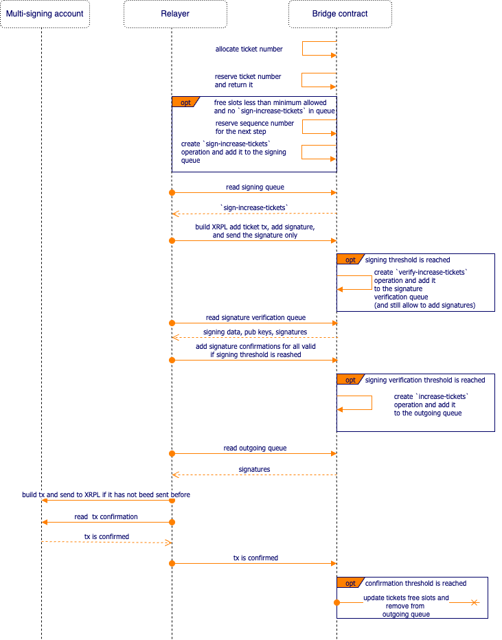

# XRPL two-way bridge spec.

The spec describes the technical solution of the XRPL two-way bridge.

## Technical solution

### XRPL multi-signing account

The account holds the tokens issued on the XRPL on its balance. Depending on workflow it either uses the received tokens
balance to send to XRPL accounts (in case the account is not an issuer) or mints and sends the tokens to XRPL accounts (
in case it is the coreum token representation issued by the address).

### Bridge contract

The bridge contract is the major state transition of the bridge. It holds the operations state and protects the
execution using the trusted addresses voting mechanism.

#### Tokens registry

Before the bridging, the token (XRPL or coruem) should be manually registered for the bridging. The tokes that are not
registered can't be bridged.

##### Coreum tokens registration/issuance

All tokens issued on XRPL that are able to be bridged from the XRPL to the coreum and back must have a representation on
the coreum. Such tokens should be registered on the contract side with the name, decimals, and fee rules. During the
registration, the contract will issue a token and will be responsible for its minting.

##### XRPL tokens registration/issuance

All tokens issued on the coreum that are able to be bridged from the coreum to XRPL and back must have a representation
on the XRPL, managed by the multi-signing account. Such tokens should be chosen manually on the contract side. The
contract will be able to fetch the name and decimals based on the denom and trigger the XRPL token issuance flow to
issue the coreum token representation on the XRPL.

#### Operation queues

##### Execution queue

The execution queue is a queue that contains bridge operations which should be confirmed before execution. Each
operation has a type, associated ID (unique identifier/hash of the operation data in the scope of type), and list of
trusted addresses that confirm that operation. Once the operation is fully confirmed it will be executed by the smart
contract.

##### Signing queue

The signing queue is a queue that contains bridge operations that should be signed before sending to XRPL. Each
operation has a type, associated ID (unique identifier/hash of the operation data in the scope of type), list of trusted
addresses, and their signatures. Once the operation received enought signature it marks it as `require confirmation`
operating and still keeps receiving signature.

###### Signing confirmation queue

Onece the signing threshold is reached, the operation is marked as an operation which require the signature
confirmations from the relayers. Each relayer takes all signatures from the operation confirms them and if weight of the
confirmed signatures reaches the threshold it sends the signatures confirmation message with all confirmed signatures.
One the contract receives enough signature confirmations it moves the operation to the outgoing queue.  
The `signing confirmation` is protection against malicious signers. If the weight of malicious signatures is less that
threshold, the bridge is still able to relayer transactions. The same mechanis will be used for the keys rotation to
remove the malicious signatures acceess.

##### Outgoing queue

The outgoing queue is similar to the execution queue, the only difference is that the queue is the data source for the
relayer to understand that they need to execute the outgoing transaction and confirm the execution. Once the operation
is fully confirmed the relayers won’t stop trying to send the corresponding transaction on the XRPL side.

#### Tickets provider

The XRPL tickets allow us to execute the transactions with non-sequential sequence numbers, hence we can execute
multiple transactions in parallel. The process is connected to the tickets provider. When any process
allocates the ticket and the free sequence length is less than max allowed the contract generates the operation
to increase the amount, and once the operation is confirmed increase the free slots on the contract as well. Check the
[ticket allocation workflow](#ticket-allocation) for more details.

#### Tokens sending

##### Sending of tokens from XRPL

The contract receives the `Send to coreum` request and starts the corresponding [workflow](#send-from-xrpl-to-coreum).

##### Sending of tokens to XRPL

The contract receives the `Send to xrpl` request and starts the corresponding [workflow](#send-from-coreum-to-xrpl).

##### Fees

Each token in the registry contains the fee config which consists of fee from XRPL to coreum and fee from coreum to
XRPL. Both fees will be taken from the amount a user sends. The fees are distributed across the signer addresses after
the successful execution of the sending.

#### Keys registration and rotation

All accounts that are able to interact with queues are registered on the contract. And can be rotated.

### Relayer

The relayer is a connector of the multi-signing account on XRPL chain and smart contract. There are multiple instances
of relayers, one for each key pair in the smart contract and multi-signing account. Most of the workflows are
implemented in the relayer. The multi-signing account and smart contracts are the data sources for them.

## Workflows

<!-- Source: https://drive.google.com/file/d/1wo-tO72N9Iww-iASw0DEk3NgA9-XQ93g/view -->

### Send from XRPL to coreum

### Send from coreum to XRPL

### Ticket allocation

