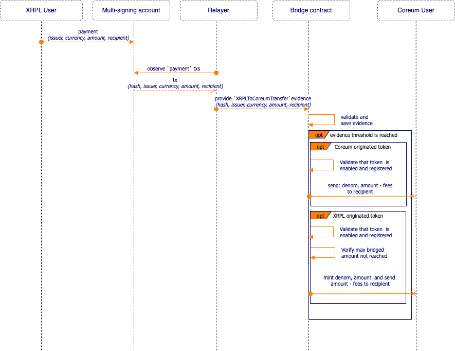
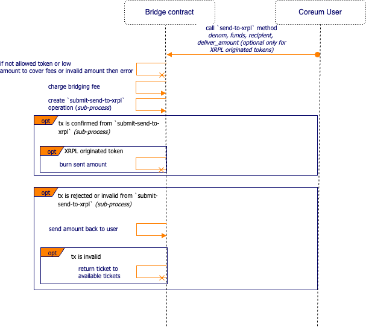
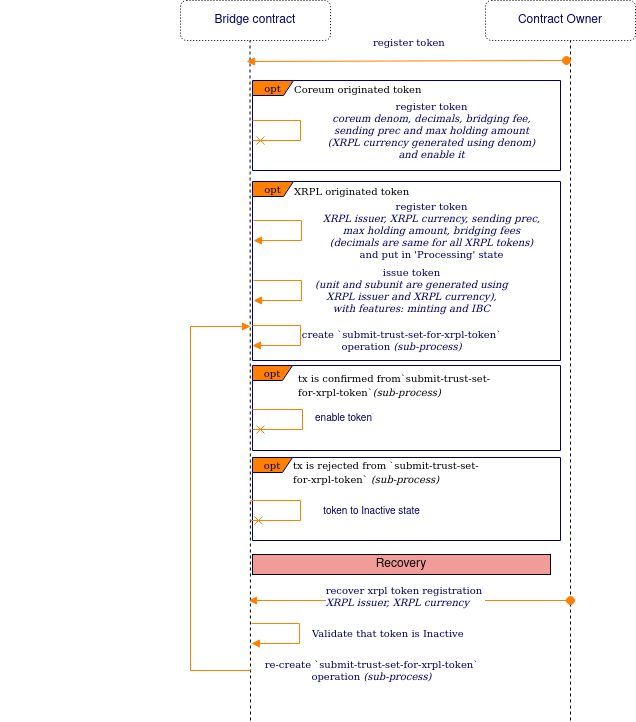
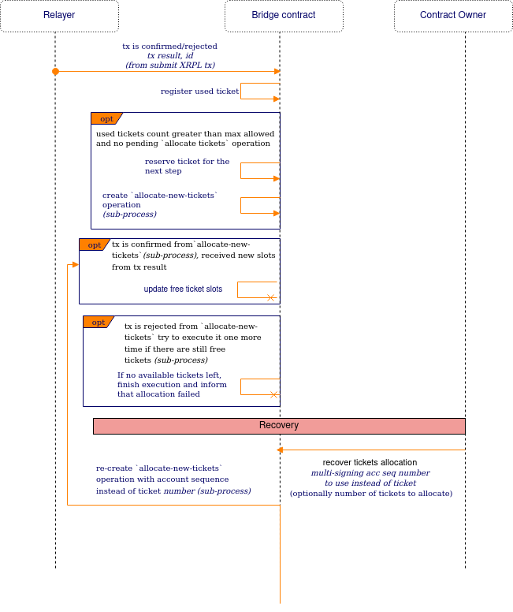
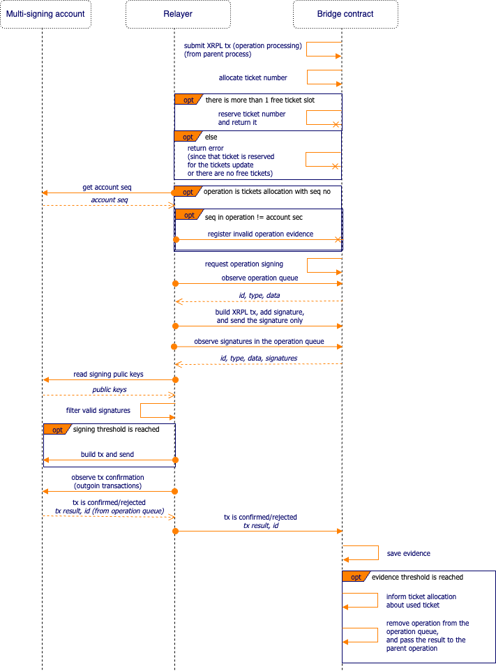
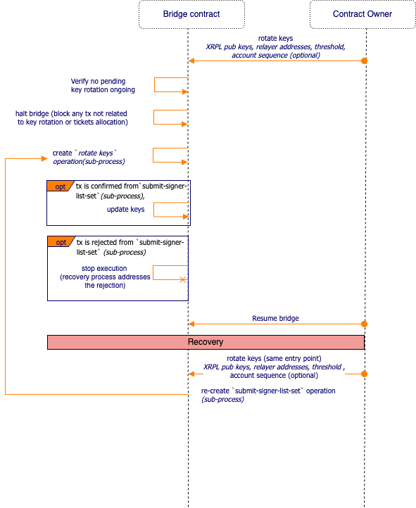

# Coreumbridge XRPL spec.

The spec describes the technical solution of the XRPL two-way bridge.

## Technical solution


### XRPL multi-signing account

The account holds the tokens issued on the XRPL on its balance. Depending on the workflow it either uses the received tokens
balance to send to XRPL accounts (in case the account is not an issuer) or mints and sends the tokens to XRPL accounts (
in case it is the Coreum token representation issued by the address). The account uses the multi-signing and public keys
associated with each relayer from the contract for the transaction signing.

### Bridge contract

The bridge contract is the major state transition of the bridge. It holds the operations state and protects the
execution using the trusted addresses voting/signing mechanisms. Also, it has an owner account that can change the
settings of the bridge and execute the workflows' recovery.

#### Tokens registry

Before the bridging, a token (XRPL or Coreum) should be manually registered for the bridging. The tokens that are not
registered can't be bridged.

##### XRPL originated tokens registration

All tokens issued on XRPL that can be bridged from the XRPL to the Coreum and back must have a representation on the
Coreum. Such tokens should be registered by owner on the contract side with the `XRPL issuer`, `XRPL currency`, `bridging fees`,
`sending precision` and `max holding amount`. The `token decimals` (always 15) will be set by the contract.
The `sending precision` and `max holding amount` should be provided taking into account the [Amount rounding handling](#amount-rounding-handling).
The token's `denom` is unique and is built by the contract using the `XRPL issuer`, `XRPL currency`, `block time` hash and `xrpl` prefix.
Required features for the issuance are `minting`, `burning`, and `IBC`. During the registration, the contract issues a
token and will be responsible for its minting when a token is bridged from the XRPL to Coreum. After the registration, the token is put in `Processing` state
and the contract triggers the `submit-trust-set-for-xrpl-token` operation to allow the multi-signing account to receive that token. If this operation succeeds, the token
will be `Enabled`, if it fails, it will be put to `Inactive` state awaiting a token registration recovery operation by the owner. The value of
the trustset limit amount will be provided during constract instantiation and saved in the config of the contract.
Check [register-token workflow](#register-token) for more details.

##### XRP token registration

The XRP token is registered in the token registry on the contract instantiation. That token uses the constant issuer
`rrrrrrrrrrrrrrrrrrrrrhoLvTp` and currency `XRP` token. That token can be enabled or disabled by the owner similar to other
tokens. Similar to XRPL originated tokens the XRP token has the `sending precision` and `max holding amount` which we set
to default values on the contact instantiation.
The XRP token has a bit of a different nature than other tokens. That token doesn't need approval (TrustSet) to be
received and is used by the multi-signing account to pay fees. XRP doesn't have a transfer rate either. Since the balance for fees and received
balance are not separated, the relayers check that there is enough balance on the multi-signing account minus the balance issued on the
contract minus some tokens on top (to cover pending transactions) to cover the fees before the transaction submission.
That doesn't guarantee that relayers don't spend locked coins, but minimises that risk. The additional monitoring of
that fee-balance might also minimise that risk.

##### Coreum originated tokens registration

All tokens issued on the Coreum that can be bridged from the Coreum to XRPL and back must have a representation on the
XRPL, managed by the multi-signing account. Such tokens should be registered by owner on the contract side with the
`coreum denom`, `token decimals`, `sending precision`, `max holding amount` and `bridging fees`. The `sending precision` and
`max holding amount` should be provided taking into account the [Amount rounding handling](#amount-rounding-handling).
The `XRPL currency` will be uniquely generated by the contract using the `denom`, `decimals`, `block time` hash with a `coreum` prefix and
encoding it into the hexadecimal currency notation used in XRPL. This will be used as a representation of
that token on the XRPL side.
Check [workflow](#register-token) for more details.

##### Token update

It is possible to update the token `state`, `sending precision`, `max holding amount` and `bridging fee`. The owner can do it by calling the contract for both
XRPL and Coreum originated tokens.

In the case of Token state, a token can be Enabled/Disabled only if it's not in Inactive/Processing State (for the first case it requires a recovery operation and for the second one it's in the middle of TrustSet operation). In the case of `sending precision`, the owner can change it to another valid sending precision value. For `max holding amount`, the owner can change it to another max holding amount as long as the bridge holds equal or less than the new value. In the case of `bridging fee`, the owner can change it to any value.

#### Operation queues

##### Evidence queue

The evidence queue is a queue that contains bridge operations which should be confirmed before execution. Each operation
has a type, associated ID (unique identifier/hash of the operation data in the scope of type), and a list of trusted
relayer addresses that provide the evidence. Once the contract receives enough evidences it removes the operation from
the queue and passes its data to the next step of a workflow.

##### Signing queue

The signing queue is a queue that contains bridge operations that should be signed before sending to XRPL and later
sent. The signing queue is a part of each operation. Each operation has a type, associated ID (unique identifier/hash
of the operation data in the scope of type), and a list of signatures. Each relayer picks such operation, signs it and
provides the signature for it. The operation keeps receiving signatures and shares them with other relayers (using the
contract). Each relayer validates the provided signatures, filters valid, and checks whether it's possible to submit the
transaction. If it is possible it builds the transaction with valid signatures (the operation ID is in the memo) and
submits the transaction to the XRPL. If multiple relayers execute the same transaction and at the same time they receive
a specific error which is an indicator for them, go to the next item in the queue.
An additional sub-process of each relayer observes all multi-signing account transactions and once it reaches that
submitted transaction (matched by the ID in memo) it provides evidence with transaction status and data (using the
evidence queue). Once such evidence is confirmed, the tx result and data will be passed to the next step of a workflow,
and operation removed from the signing queue.

##### Operations deduplication

The contract queues always have an operation ID which is built from the operation data. We do it to make the processing
idempotent. And let some operations be safely re-processed at any time.

#### Ticket allocation

##### Ticket allocation process

The XRPL tickets allow us to execute a transaction with non-sequential sequence numbers, hence we can execute multiple
transactions in parallel. Any workflow can allocate a ticket and the ticket allocation mechanism either returns a ticket
number or errors out, in case of lack of the free tickets. The ticket re-allocation will be triggered by the tx
confirmation (Submit XRPL transaction last step) once the used tickets count is greater than the allowed threshold. The
contract initiates the `allocate-new-tickets` operation to increase the amount. Once the operation is confirmed, the
contract increases the free slots on the contract as well (based on the tx result). In the case the `allocate-new-tickets` operation
is rejected, another `allocate-new-tickets` operation will initiated by the contract. If no tickets are available, the contract will
finish execution but notify with an event that it has run out of tickets. If this happens, the contract owner must initiate the ticket recovery workflow.

Check [workflow](#allocate-ticket) for more details.

#### Tokens sending

##### Sending of tokens from XRPL

The contract receives a `save-evidence` request with an `XRPL-to-coreum-transfer` evidence and starts the corresponding [workflow](#send-from-xrpl-to-coreum).

##### Sending of tokens to XRPL

The multi-signing account receives coins for a user, a relayer observes the transaction and initiates
the [workflow](#send-from-coreum-to-xrpl).

##### Fees

###### Fee charging

Each token in the registry contains a bridging fee config. The bridging fee is the fee that relayers earn for the transaction relaying. 
That fee covers their costs and provides some profit on top. The fee will be taken from the amount a user sends. The bridging fees are 
distributed across the relayer addresses after the execution of the sending, and locked until each relayer manually requests it (indicating how much of each
denom he's requesting). After such a request the accumulated bridging fee for that relayer will be distributed to the relayer address.

###### Fee charging from XRPL to Coreum

When a user transfers a token from the XRPL to Coreum we can compute the expected received amount based on the formula:

```text
amountAfterBridgeFees = amount - bridgingFee
amountAfterDecimalConversion = amountAfterBridgeFees * 1e(tokenDecimalsInCoreum-15)
receivedIntAmount = roundWithSendingPrecision(amountAfterDecimalConversion)
```

The `roundWithSendingPrecision` is described [here](#amount-rounding-handling) .

A relayer relays the amount sent as a part of the evidence. The contract
does a pre-validation of the value. If, after the calculation, the `receivedIntAmount = 0` or
`receivedIntAmount > max allowed value` returns an error. Once the evidence threshold is reached, the contract executes
the calculation one more time, and sends the amount to the recipient. The rounding reminder will be added to the bridge fees
that the relayers can claim.

###### Fee charging from Coreum to XRPL

When a user transfers a token from the Coreum to an XRPL account we can compute the expected received amount based on
formula:

```text
amountAfterBridgeFees = amount - bridgingFee
amountAfterRounding = roundWithSendingPrecision(amountAfterTransferFees)
receivedIntAmount = amountAfterRounding * 1e(15-tokenDecimalsInCoreum)
```

The contract receives the `send-to-XRPL` request for a user, executes the formula and checks, if after the calculation
the `receivedIntAmount = 0` or `amount + currentBridgedAmount > max allowed bridged value` (only applied for Coreum originated tokens) returns an error.
If all validation pass, the contract creates a sending operation with receivedIntAmount, and distributes relayers fees.
The `send-to-XRPL` request has an optional field `deliver_amount` that is used to indicate that the amount to be sent on XRPL is less than the amount sent to the contract.
This is a way to deal with tokens that have a transfer fee. The fees will be calculated normally but the operation created will adjust the amount and max amount that 
needs to be considered for the transaction on XRPL.

###### Bridging fee re-config

The owner can change a token bridging fees at any time. Since the price of a token can change, there is a possibility that
the owner wants to adjust the bridging fee for that token.

###### XRPL base fee re-config

At the time of the contract instantiation the owner sets the initial `xrpl_base_fee` used for the XRPL transaction fee.
The formula for the fee is `xrpl_tx_fee = (1 + number of signatures) * xrpl_base_fee`. The fee should be the same for
all relayers since it influences the operation signature. It is required for the fee to be updated since at some point
in time the XRPL chain might be under a high load and transactions from the Coreum to XRPL might be not accepted by the
nodes and get stuck. The fee update process helps to resolve such issues:

* owner calls the contract a provides new `xrpl_base_fee`
* the contract
   * updates the `xrpl_base_fee` in config
   * removes signatures from all pending operations
   * increment the version of the pending operations

Since the version of the operations is updated and `xrpl_base_fee` is changed (increased for example) the relayers will
resign the transaction and a new fee will be used for the XRPL node to execute the transaction.

##### Kill switch

It is possible for any relayer or owner to halt the bridge contract at any time. The reason for it might be
unexpected behavior on any bridge component. Only the owner can resume the bridge.

#### Keys rotation

All accounts that can interact with the contract or multi-signing account are registered on the contract. And can be
rotated using the key rotation workflow. The workflow is triggered by the owner. The owner provides
the new relayer Coreum addresses, XRPL public keys, signing/evidence threshold and an optional account sequence (in case there is
no ticket available). This action will automatically halt the bridge in case it is not halted yet and start the key rotation workflow.
During this workflow execution, no operations are allowed on the contract except for key rotation evidences from the
relayers. If there is a key rotation in process, the owner cannot trigger another key rotation. Once the key rotation operation has been
confirmed by the relayers, the owner can trigger another key rotation (if needed/it failed) and/or resume the bridge.
This option gives the owner an ability to rotate the keys in case of a malicious relayer, or if the malicious relayer halted it. Check [workflow](#rotate-keys) for more details.

### Relayer

The relayer is a connector of the multi-signing account on XRPL chain and smart contract. There are multiple instances
of relayers, one for each key pair in the smart contract and multi-signing account. Most of the workflows are
implemented as event processing produced by the contract and multi-signing account.

## Amount rounding handling

### XRPL chain number handling:

The number on the XRPL chain is handled by the [string-numbers](https://xrpl.org/currency-formats.html#string-numbers)
type. As the result some discrepancy might happen, examples:

1. When a recipient balance is high and the recipient receives too low amount the delivery amount contains that amount,
   but recipient balance remains the same.
2. When a sender sends too low amount to a recipient with high balance the sender's balance is changed but recipient's
   balance remains the same.
3. It is possible to mint tokens on the XRPL by sending too low amounts to a recipient with low balance from an account
   with high balance.

### Issues:

1. Send low and high amount to Coreum and return high and low back.
   1.1. XRPLUser sends 10 XRPL originated token to coreumUser (bridge account balance: 10, coreumUser balance: 10)
   1.2. XRPLUser sends 1e17 XRPL originated token to coreumUser (bridge account balance: 1e17, coreumUser balance: 1e17 + 10)
   1.3. coreumUser sends 1e17 XRPL originated token to XRPLUser (bridge account balance: 0, XRPLUser balance: 1e17)
   1.3. coreumUser sends 10 XRPL originated token to XRPLUser (bridge account: fail since we have nothing to send)

The same issue might be in case the bridge account holds 1e20 and receive 1 XRPL originated token. The delivered amount will
contain the 1 XRPL originated token, but the bridge balance will remain the same.

2. Send Coreum originated token to XRPL, mint it there, and send back.
   1.1. CoreumUser sends 1e17 Coreum originated token to XRPLUser (bridge account balance: 0, bridge contract: 1e17,
   XRPLUser balance: 1e17)
   1.2. XRPLUser mints 100 tokens on the XRPL by sending 49, 49, 2 amounts to a recipient with low balance and back.
   1.3. XRPLUser sends 100 tokens back to coreumUser (bridge account balance: 0, bridge contract: 1e17 - 100, CoreumUser
   balance: 100)
   1.3. XRPLUser sends 1e17 tokens back to coreumUser (bridge account balance: 0, bridge contract: fail not enough
   balance locked on the contract)

### Handling

The `sending precision` is the number in range `-15:15` we use for each registered token. That value defines the min
precision for the amount you can send (`round with sending precision` formula). Additionally, we define the
`max holding amount` for to hold per token. We have both limits to make hardly possible both issues described before.
The rounding with `sending precision` will eliminate the risk of sending to low amount which could influence on the
bridge, and the `max holding amount` will significantly limit the chance to hold and amount using which a holder can
produce on XRPL the amount which is greater than rounded amount with the `sending precision` (`significant amount`).

That `sending precision` can be calculated using the formula:

```text
ratio = (totalTokenSupply) / 1e16
if ratio < 1 {
    sendingPrecision = (count of zeros after `0.`)
}
if ratio == 1 {
    sendingPrecision = 0
}
if ratio > 1 {
    sendingPrecision = (count of integer numbers)
}

sendingPrecision = sendingPrecision - complexityCoefficient.
```

The `1e16` is the minimum amount a holder should have to produce one token on the XRPL submitting one transaction.

The `totalTokenSupply` here is the total issued amount on the chain. For the XRPL chain we take simply total supply,
but for the Coreum chain we take the total supply divided by the token decimals, since the Coreum chain uses the integer
for the amounts, but XRPL uses float.

The `complexityCoefficient` is coefficient we use to improve the `risks handling`. Without that coefficient the formula
provides a `risks handling` when an account holding the total supply is able to produce `significant amount`
submitting on XRPL transaction just one transaction. But with that coefficient, the account will have to submit
`1e complexityCoefficient` transactions minimum to do it. The recommended value for the `complexityCoefficient`
is `4`, so it means `10000` transactions minimum are needed to produce the `significant amount`.

The recommended `max holding amount` should be less or equal `1e(16 - sending precision)`.

The `round with sending precision` formula is:

```text
// for the simplicity the formula doesn't include zero division handling

func roundWithSendingPrecision (ratValue Rat, sendingPrecision int) Rat{
   nominator := ratValue.Nominator
   denominator := ratValue.Denominator

   case: sendingPrecision > 0:
     nominator = (nominator / (denominator / 1e(sendingPrecision))) * (denominator / 1esendingPrecision)
   case: sendingPrecision == 0:
     nominator = nominator / denominator
   denominator = 1
     case sendingPrecision < 0:
   nominator = (nominator / denominator / 1e(-1*sendingPrecision)) * 1e(-1*sendingPrecision)
     denominator = 1

   return Rat{nominator, denominator}
}
```

Rounding examples:

```text
sending precision: 0
sending value: 99999.99999
rounded value: 99999
```

```text
sending precision: 2
sending value: 99999.99999
rounded value: 99999.99
```

```text
sending precision: -2
sending value: 99999.99999
rounded value: 99900
```

Full usage examples:

```text
token total supply on XRPL: 500,000,000
complexityCoefficient: 4
ratio = 500,000,000 / 1e16 = 0.00000005
sendingPrecision = 7 - complexityCoefficient = 3
min sending amount = 0.001
```

```text
token total supply on Coreum: 1e11 * 1e6(decimals)
complexityCoefficient: 4
ratio = 1e11 * 1e6(decimals)/1e6(decimals) / 1e16 = 0.00001
sendingPrecision = 4 - complexityCoefficient = 0
min sending amount = 1
```

## Workflows

<!-- Source: https://drive.google.com/file/d/1wo-tO72N9Iww-iASw0DEk3NgA9-XQ93g/view -->

### Send from XRPL to coreum



### Send from coreum to XRPL



### Register token



### Allocate-ticket



### Submit XRPL transaction



### Rotate keys


